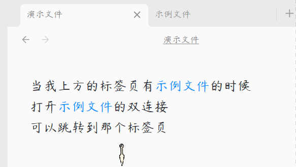

# ✦ Unique Tab (单笔记单标签页) ✦

我在小红书发布了许多obsidian的教程和插件开发进度，你的关注就是对我最大的支持

打开同一个文件，永远只有一个标签页。

  

[简体中文](#简体中文) | [用法](#用法) | [English](#english) | [Usage](#usage)

---

## 简体中文

### 核心功能

#### 1. 单标签页限制
确保每个笔记、Canvas（白板）或其他文件在整个工作区中仅占用一个标签页，避免重复打开相同的文件。

#### 2. 智能重定向
无论您是通过文件树、快速切换（Quick Switcher）、全局搜索，还是通过双链点击打开笔记，若该文件已打开，插件会自动聚焦到已有标签页，无需手动寻找。

#### 3. 视觉无缝过渡
优化了标签页拦截逻辑，瞬间自动关闭新产生的空白多余标签页，减少页面切换时的视觉闪烁与白屏抖动。

#### 4. 全文件类型支持
不仅支持标准 Markdown 笔记，还完美兼容 Canvas、数据库以及其他第三方插件生成的自定义视图文件。

***

## 用法

1. 安装插件后，无需任何配置即可开始工作。
2. 当您尝试以任何方式（点击链接、搜索结果或文件树）打开一个已经在其他标签页中激活的笔记时，插件会自动将您的视线和焦点切换到原本已存在的那个标签页上，并温和地关闭新生成的空白页面。
3. 插件完全自动化运行，无需手动干预。

***

### 赞赏支持

🎁 如果觉得有用，请作者喝杯咖啡

 

  

***

### 安装方法

#### 方法一：社区插件安装（推荐）

待插件通过审核并上架社区市场后：
1. 打开 Obsidian **设置** > **社区插件** > **浏览**。
2. 搜索并选择 `Unique Tab`。
3. 点击 **安装** 并选择 **启用**。

#### 方法二：手动安装

1. 前往 [Releases](https://github.com/hornatx/unique-tab/releases) 页面下载最新的 `main.js` 和 `manifest.json` 文件。
2. 打开您的 Obsidian 库所在的本地文件夹。
3. 进入 `.obsidian/plugins/` 目录，并创建一个名为 `unique-tab` 的文件夹。
4. 将下载的两个文件放入该文件夹中。
5. 在 Obsidian **设置** > **社区插件** 中重新加载并开启该插件。

***

QQ 交流群：1094620986

---

## English

**Unique Tab** — A lightweight Obsidian plugin that prevents opening duplicate tabs for the same note. It ensures each file occupies only one tab in your workspace, providing **seamless redirection, zero visual flashing, and universal file type support**.

***

### Features

#### 1. Single Tab Constraint
Ensures that each note, Canvas, or other files can only occupy one open tab in your active workspace, preventing clutter.

#### 2. Smart Redirection
Whether opening a note from the file explorer, Quick Switcher, global search, or internal links, the plugin automatically shifts focus to the already-open tab.

#### 3. Visual Glitch Reduction
Optimized tab interception logic that instantly closes newly spawned empty placeholder tabs, minimizing visual flickering or brief white screen flashes.

#### 4. Universal File Support
Works smoothly with standard Markdown notes, Canvas, database files, and other custom view types generated by third-party plugins.

***

## Usage

1. After installing the plugin, it works without any configuration.
2. When you attempt to open an already-opened note (via search, explorer, or links), the plugin will instantly navigate your view to the existing tab and quietly dispose of the newly created duplicate.
3. The plugin runs completely automatically without manual intervention.

***

### Installation

#### Method 1: Community Plugins (Recommended)

Once the plugin is reviewed and listed on the community marketplace:
1. Open Obsidian **Settings** > **Community plugins** > **Browse**.
2. Search for and select `Unique Tab`.
3. Click **Install** and then **Enable**.

#### Method 2: Manual Installation

1. Go to the [Releases](https://github.com/hornatx/unique-tab/releases) page to download the latest `main.js` and `manifest.json` files.
2. Open your Obsidian vault folder on your computer.
3. Navigate to the `.obsidian/plugins/` directory and create a folder named `unique-tab`.
4. Place the downloaded files into this folder.
5. Reload and enable the plugin in Obsidian **Settings** > **Community plugins**.

***

QQ Group: 1094620986
